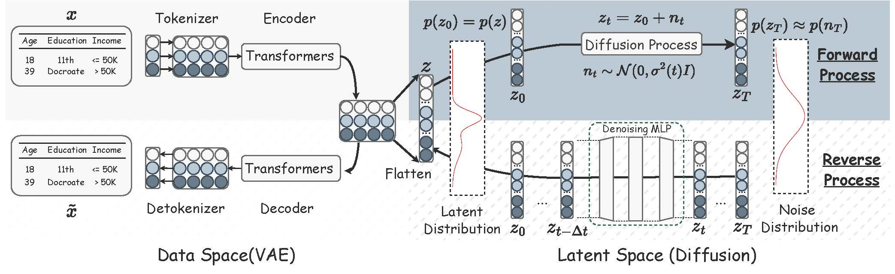
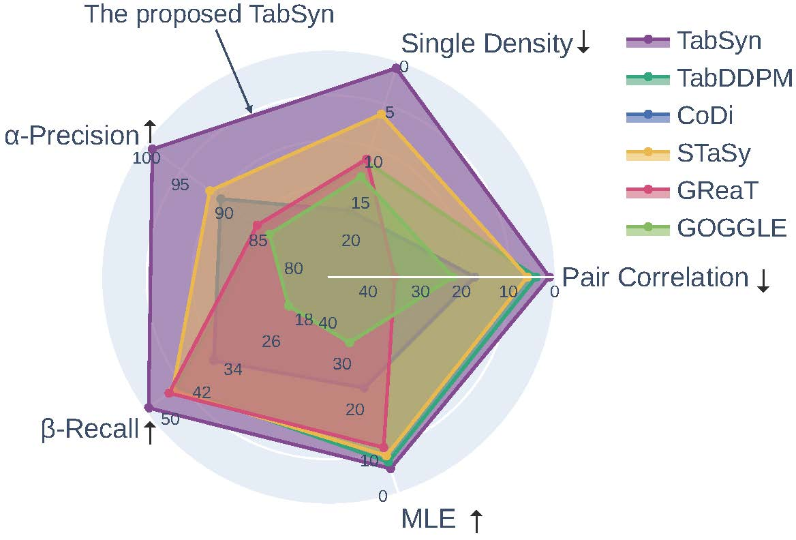
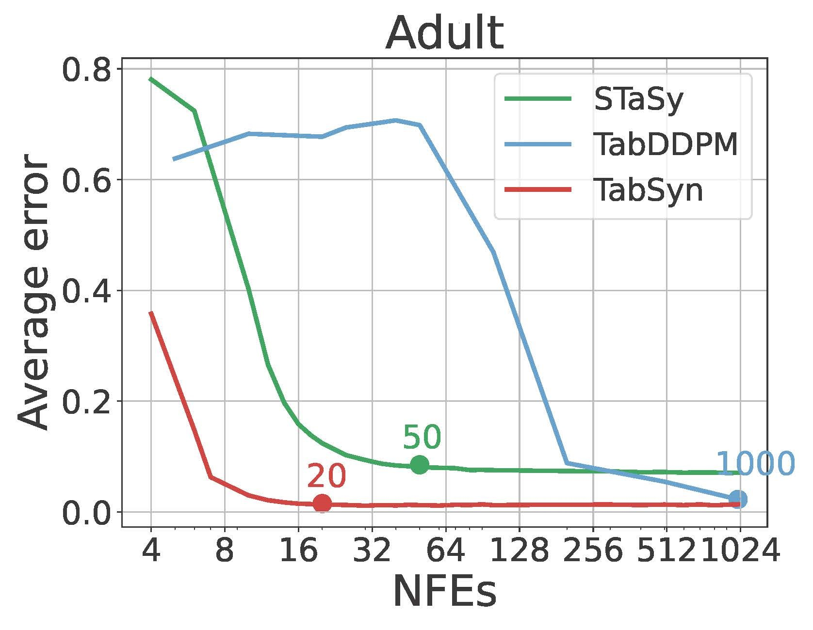
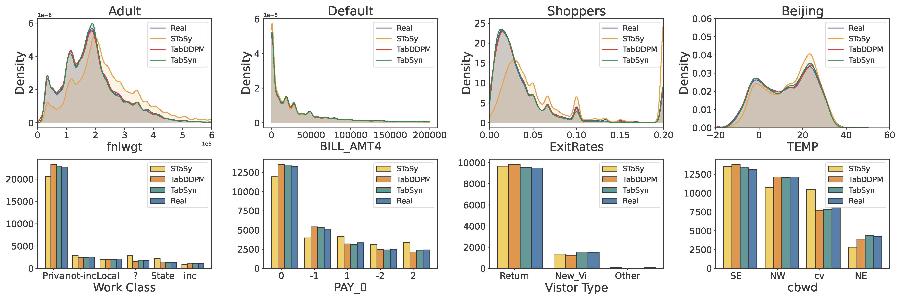

# (ICLR 2024 Oral) Mixed-Type Tabular Data Synthesis with Score-based Diffusion in Latent Space 

<p align="center">
  <!-- <a href="https://github.com/hengruizhang98/tabsyn/blob/main/LICENSE">
    
  </a> -->
  <a href="https://github.com/hengruizhang98/tabsyn/blob/main/LICENSE">
    
  </a>
  <a href="https://openreview.net/forum?id=4Ay23yeuz0">
    
  </a>
  <a href="https://arxiv.org/abs/2310.09656">
    
  </a>
</p>

This repository contains the implementation of the paper:
> **Mixed-Type Tabular Data Synthesis with Score-based Diffusion in Latent Space**  <br>
> The Twelfth International Conference on Learning Representations (ICLR 2024, Oral Presentation)<br>
> Hengrui Zhang, Jiani Zhang, Balasubramaniam Srinivasan, Zhengyuan Shen, Xiao Qin, Christos Faloutsos, Huzefa Rangwala, George Karypis <br>

## Latest Update
- [2024-06-20]: Disable loading irrelvent packages when training individual models; update the instruction for DCR experiements; fix minor bugs in TabSyn's training script.
- [2024-05-14]: Add demo code for missing value imputation for the target column with a well trained TabSyn.

## Introduction

<div align="center">
  
  <br>
  <br>
</div>
TabSyn is a deep generative model for the synthesis of mixed-type tabular data (i.e., continuous/numerical and discrete/categorical). Tabsyn consists of two parts: 1) A Variational AutoEncoder (VAE) that encodes mixed-type of tabular data into the continuous latent space. 2) A score-based diffusion model for learning the densities of the latent embeddings.

###### TabSyn achieves SOTA performance in recovering the ground-truth distribution of tabular data (under five distinct metrics), and has a significantly faster sampling speed than previous diffusion-based methods.
<div style="display:flex; justify-content:center;">
    
    
</div>

###### Visualizations of density estimation for signle column and pair-wise correlation.
<div align="center">
  
  <br>
  <br>
</div>
<div align="center">
  
  <br>
  <br>
</div>

<!-- <div align="center">
  
  <br>
  <br>
</div> -->


## Installing Dependencies

Python version: 3.10

Create environment

```
conda create -n tabsyn python=3.10
conda activate tabsyn
```

Install pytorch
```
pip install torch torchvision torchaudio
```

or via conda
```
conda install pytorch==2.0.1 torchvision==0.15.2 torchaudio==2.0.2 pytorch-cuda=11.7 -c pytorch -c nvidia
```

Install other dependencies

```
pip install -r requirements.txt
```

Install dependencies for GOGGLE

```
pip install  dgl -f https://data.dgl.ai/wheels/cu117/repo.html

pip install torch_geometric
pip install pyg_lib torch_scatter torch_sparse torch_cluster torch_spline_conv -f https://data.pyg.org/whl/torch-2.0.1+cu117.html
```

Create another environment for the quality metric (package "synthcity")

```
conda create -n synthcity python=3.10
conda activate synthcity

pip install synthcity
pip install category_encoders
```

## Preparing Datasets

### Using the datasets adopted in the paper

Download raw dataset:

```
python download_dataset.py
```

Process dataset:

```
python process_dataset.py
```

### Using your own dataset

First, create a directory for you dataset [NAME_OF_DATASET] in ./data:
```
cd data
mkdir [NAME_OF_DATASET]
```

Put the tabular data in .csv format in this directory ([NAME_OF_DATASET].csv). **The first row should be the header** indicating the name of each column, and the remaining rows are records.

Then, write a .json file ([NAME_OF_DATASET].json) recording the metadata of the tabular, covering the following information:
```
{
    "name": "[NAME_OF_DATASET]",
    "task_type": "[NAME_OF_TASK]", # binclass or regression
    "header": "infer",
    "column_names": null,
    "num_col_idx": [LIST],  # list of indices of numerical columns
    "cat_col_idx": [LIST],  # list of indices of categorical columns
    "target_col_idx": [list], # list of indices of the target columns (for MLE)
    "file_type": "csv",
    "data_path": "data/[NAME_OF_DATASET]/[NAME_OF_DATASET].csv"
    "test_path": null,
}
```
Put this .json file in the .Info directory.

Finally, run the following command to process the UDF dataset:
```

```

## Training Models

For baseline methods, use the following command for training:

```
python main.py --dataname [NAME_OF_DATASET] --method [NAME_OF_BASELINE_METHODS] --mode train
```

Options of [NAME_OF_DATASET]: adult, default, shoppers, magic, beijing, news
Options of [NAME_OF_BASELINE_METHODS]: smote, goggle, great, stasy, codi, tabddpm

For Tabsyn, use the following command for training:

```
# train VAE first
python main.py --dataname [NAME_OF_DATASET] --method vae --mode train

# after the VAE is trained, train the diffusion model
python main.py --dataname [NAME_OF_DATASET] --method tabsyn --mode train
```

## Tabular Data Synthesis

For baseline methods, use the following command for synthesis:

```
python main.py --dataname [NAME_OF_DATASET] --method [NAME_OF_BASELINE_METHODS] --mode sample --save_path [PATH_TO_SAVE]
```

For Tabsyn, use the following command for synthesis:

```
python main.py --dataname [NAME_OF_DATASET] --method tabsyn --mode sample --save_path [PATH_TO_SAVE]

```

The default save path is "synthetic/[NAME_OF_DATASET]/[METHOD_NAME].csv"

## Evaluation
We evaluate the quality of synthetic data using metrics from various aspects.

#### Density estimation of single column and pair-wise correlation ([link](https://docs.sdv.dev/sdmetrics/reports/quality-report/whats-included))

```
python eval/eval_density.py --dataname [NAME_OF_DATASET] --model [METHOD_NAME] --path [PATH_TO_SYNTHETIC_DATA]
```


#### Alpha Precision and Beta Recall ([paper link](https://arxiv.org/abs/2102.08921))
- $\alpha$-preicison: the fidelity of synthetic data
- $\beta$-recall: the diversity of synthetic data

```
python eval/eval_quality.py --dataname [NAME_OF_DATASET] --model [METHOD_NAME] --path [PATH_TO_SYNTHETIC_DATA]
```

#### Machine Learning Efficiency

```
python eval/eval_mle.py --dataname [NAME_OF_DATASET] --model [METHOD_NAME] --path [PATH_TO_SYNTHETIC_DATA]
```

#### Pricavy protection: Distance to Closest Record (DCR)

```
python eval/eval_dcr.py --dataname [NAME_OF_DATASET] --model [METHOD_NAME] --path [PATH_TO_SYNTHETIC_DATA]
```

Note: the optimal DCR score depends on the ratio between #Train and #Holdout (# Test). Ideally, DCR sore should be #Train / (#Train + #Holdout). To let the optimal score be $50\%$, you have to let the training and testing set have the same size. 

#### Detection: Classifier Two Sample Tests (C2ST)

```
python eval/eval_detection.py --dataname [NAME_OF_DATASET] --model [METHOD_NAME] --path [PATH_TO_SYNTHETIC_DATA]
```

#### Missing Value Imputation for the Target Column

```
python impute.py --dataname [NAME_OF_DATASET]
```
The imputed tale will be saved at impute/[NAME_OF_DATASET]

To evaluate the imputed target column regarding the classification task, use the following command:

 ```
python eval_impute.py --dataname adult
```

Currently, TabSyn only supports imputing multiple numerical columns and/or a single categorical column. The demo code only imputes the target column given a dataset, as indicated by the 'target_col_idx' in the dataset metadata JSON file. Below is a basic introduction to our imputation strategy:

- For numerical columns, missing values are replaced with the average values of the corresponding columns in the training set.

- For the categorical column, in each imputation trial, we randomly select from all possible categories with uniform probabilities.

- Next, the masked data is fed into the VAE model to obtain their embeddings.

- When applying the diffusion inpainting method, we remask the corresponding dimensions of the embeddings according to the relative positions of the embeddings and the raw input. For example, if the masked column index for the raw data is 0, and the token dimension is 4, we mask dimensions [0, 1, 2, 3] in their embeddings. Then, we apply the inpainting method illustrated in Eq. 39 to perform diffusion inpainting, and finally, we obtain the imputation result for one trial.

- Since diffusion inpainting is stochastic (and for the categorical column, we sample the category randomly), we need to repeat the imputation algorithm several times (e.g., 50), and take the averaged imputation result as the final result.


## Security

See [CONTRIBUTING](CONTRIBUTING.md#security-issue-notifications) for more information.

## License

This project is licensed under the Apache-2.0 License.


## Reference
We appreciate your citations if you find this repository useful to your research!
```
@inproceedings{tabsyn,
  title={Mixed-Type Tabular Data Synthesis with Score-based Diffusion in Latent Space},
  author={Zhang, Hengrui and Zhang, Jiani and Srinivasan, Balasubramaniam and Shen, Zhengyuan and Qin, Xiao and Faloutsos, Christos and Rangwala, Huzefa and Karypis, George},
  booktitle={The twelfth International Conference on Learning Representations},
  year={2024}
}
```
```
@article{zhang2023mixed,
  title={Mixed-Type Tabular Data Synthesis with Score-based Diffusion in Latent Space},
  author={Zhang, Hengrui and Zhang, Jiani and Srinivasan, Balasubramaniam and Shen, Zhengyuan and Qin, Xiao and Faloutsos, Christos and Rangwala, Huzefa and Karypis, George},
  journal={arXiv preprint arXiv:2310.09656},
  year={2023}
}
```